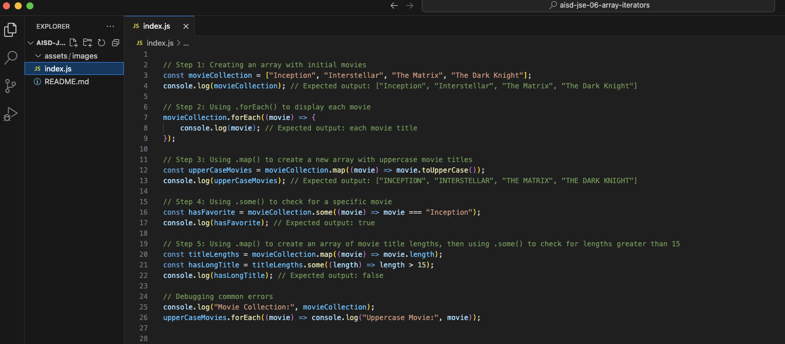

# JavaScript Basics: Array Iterators


## Description 📄
In this project, you will practice working with array iterators in JavaScript. You will explore the `.forEach()`, `.map()`, and `.some()` methods, understanding how to loop through arrays, transform elements, and check conditions effectively. This hands-on experience will help you appreciate the efficiency and simplicity these methods bring to your code.

## Expected Project Structure 🏗️
Your project will have the following structure:
```
ArrayIteratorsPartOne/
└── index.js
```

# Instructions ✅

## 1. **Create the Project Folder and File**
You will begin by setting up your project structure.

- [ ] Create a folder named `ArrayIteratorsPartOne` to store your project files.
- [ ] Inside the `ArrayIteratorsPartOne` folder, create a file named `index.js`. This file will contain all your JavaScript code.

## 2. **Create a Movie Collection Array**
You will start by creating an array to store a list of movies.

- [ ] In your `index.js` file, add the following code to create an array called `movieCollection` with a few initial movies:

```javascript
// Step 1: Creating an array with initial movies
const movieCollection = ["Inception", "Interstellar", "The Matrix", "The Dark Knight"];
console.log(movieCollection); // Expected output: ["Inception", "Interstellar", "The Matrix", "The Dark Knight"]
```

- [ ] Run your JavaScript file in the terminal with the command `node index.js` to see your array.

**Expected Output:**
```
[ 'Inception', 'Interstellar', 'The Matrix', 'The Dark Knight' ]
```

**Explanation:**
- The variable `movieCollection` holds an array containing four movie titles.
- The `console.log()` function prints the array to the console, displaying the list of movies you have added.

## 3. **Use .forEach() to Display Movies**
Next, you will learn to display all movies in your array using the `.forEach()` method.

- [ ] Update your `index.js` file with the following code:

```javascript
// Step 2: Using .forEach() to display each movie
movieCollection.forEach((movie) => {
    console.log(movie); // Expected output: each movie title
});
```

- [ ] Run your JavaScript file in the terminal with the command `node index.js` to see the output.

**Expected Output:**
```
Inception
Interstellar
The Matrix
The Dark Knight
```

**Explanation:**
- The `.forEach()` method executes the provided function once for each element in the array, allowing you to perform actions like logging each movie title to the console.

## 4. **Create a New Array with .map()**
Now, you will transform the movie titles into uppercase using the `.map()` method.

- [ ] Add the following code to your `index.js`:

```javascript
// Step 3: Using .map() to create a new array with uppercase movie titles
const upperCaseMovies = movieCollection.map((movie) => movie.toUpperCase());
console.log(upperCaseMovies); // Expected output: ["INCEPTION", "INTERSTELLAR", "THE MATRIX", "THE DARK KNIGHT"]
```

- [ ] Run your JavaScript file in the terminal with the command `node index.js` to see the output.

**Expected Output:**
```
[ 'INCEPTION', 'INTERSTELLAR', 'THE MATRIX', 'THE DARK KNIGHT' ]
```

**Explanation:**
- The `.map()` method creates a new array populated with the results of calling a provided function on every element in the calling array. Here, it transforms each movie title to uppercase.

## 5. **Check for a Favorite Movie with .some()**
Next, you will check if your favorite movie is in the collection using the `.some()` method.

- [ ] Update your `index.js` with the following code:

```javascript
// Step 4: Using .some() to check for a specific movie
const hasFavorite = movieCollection.some((movie) => movie === "Inception");
console.log(hasFavorite); // Expected output: true
```

- [ ] Run your JavaScript file in the terminal with the command `node index.js` to see the output.

**Expected Output:**
```
true
```

**Explanation:**
- The `.some()` method tests whether at least one element in the array passes the test implemented by the provided function. In this case, it checks if "Inception" is present in the movie collection.

## 6. **Combine Array Methods**
Finally, you can combine these methods for a fun challenge. Check if any movie title is longer than 15 characters after transforming the titles to include their lengths.

- [ ] Add this code to your `index.js` file:

```javascript
// Step 5: Using .map() to create an array of movie title lengths, then using .some() to check for lengths greater than 15
const titleLengths = movieCollection.map((movie) => movie.length);
const hasLongTitle = titleLengths.some((length) => length > 15);
console.log(hasLongTitle); // Expected output: false
```

- [ ] Run your JavaScript file in the terminal with the command `node index.js` to see the output.

**Expected Output:**
```
false
```

**Explanation:**
- The first line uses `.map()` to create a new array, `titleLengths`, that contains the lengths of each movie title.
- The `.some()` method is then applied to this new array to check whether any of the lengths exceed 15 characters. The result will be `false` since none of the titles do.


## 7. **Debug Common Errors**
To enhance your debugging skills, add `console.log()` statements at key points in your `index.js` to track changes:

```javascript
// Step 6: Debugging common errors
console.log("Movie Collection:", movieCollection);
upperCaseMovies.forEach((movie) => console.log("Uppercase Movie:", movie));
```

**Explanation:**
- Logging the state of your array helps identify issues, such as incorrect values or unexpected results, enhancing your debugging skills.

## 8. **Test Your Knowledge**
Consider creating an array of your favorite songs, adding and removing titles, checking for specific songs, and creating subarrays based on genres.

## 9. **Commit and Push to GitHub**
Ensure you commit your work to your local Git repository and push it to GitHub.

# Conclusion 📄
In this project, you learned how to utilize the `.forEach()`, `.map()`, and `.some()` methods to work with arrays in JavaScript. You practiced displaying, transforming, and checking elements in an array, which are foundational skills for managing data in your JavaScript programs.

---

### Solution Codebase 👀
🛑 **Only use this as a reference** 🛑

💾 **Not something to copy and paste** 💾

**Note:** This lab references a solution file located [here](https://github.com/HackerUSA-CE/aisd-jse-06-array-iterators/tree/solution) (link not shown).


© All rights reserved to ThriveDX